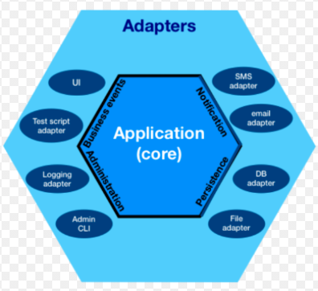

# Chapter 6 트우터

## 요구사항
- 사용자가 게시하는 마이크로 블로그를 **트웃** 이라고 한다.
- 사용자들은 연속적인 트웃 스트림을 갖는다.
- 다른 사용자들을 팔로우 할 수 있다.
- 팔로우 한 대상이 무엇을 트우팅 했는지 알 수 있다.
- 사용자는 고유 ID / PASSWORD 로 트우터에 로그인 한다.
- 자신이 팔로우하는 사용자 집합을 갖는다.
- 트웃을 전송할 수 있으며 로그인한 모든 팔로워는 트웃을 바로 볼 수 있다.
- 로그인시 최종 로그인 이후의 모든 트웃을 볼 수 있다.
- 트웃을 삭제할 수 있으며 삭제된 트웃은 볼 수 없다.
- 모바일/웹 등으로 로그인이 가능하다.

## 설계
- 데스크톱 / 스마트폰 등 다양한 환경에서 이용이 가능해야한다.
- 이런 경우 대부분 **클라이언트 / 서버 모델 (Client-Serve-Model)** 로 이를 해결한다.
    - 클라이언트는 서비스 사용자
    - 서버는 서비스 제공자

> 사용자는 서버로 트웃을 전송하며 서버로 부터 트웃을 받을 수 있어야 한다.

### 풀 기반
- 풀 기반 통신에서는 클라이언트가 서버로 정보를 요청하고 응답을 받는다.
- 일반적으로 Point-To-Point 혹은 Request-Response 통신으로 불린다.
- 대부분의 웹이 이 방식을 취하고 있다.


### 푸시 기반
- 푸시 기반 통신은 Reactive 혹은 Event-Driven 이라고 한다.
- 작성자 (Publisher) 가 발행한 이벤트 스트림을 여러 구독자가 수신한다.
    - 일대일 혹은 일대다 통신을 지원
- 주식 시장 거래 프로그램과 같은 경우 유용하다.

> 우리가 구현할 트우터에서는 트웃 스트림이 메인이므로 이벤트 드리븐 바잇ㄱ을 취한다.

## 이벤트와 설계

### 이벤트 통신
- 웹 소켓
    - TCP 스트림으로 양방향 이벤트 통신을 지원하는 가벼운 프로토콜
    - 웹 서버와 웹 브라우저 사이에 이벤트 통신시 주로 사용
- AWS SQS 와 같은 메세지 큐
    - 그룹내 프로세스 중 한 프로세스가 전송된 메세지를 받아 처리하는 상호 프로세스 통신 방식
    - 최근에 많이 이용된다.
    - Aeron, ZeroMQ, AMQP 등
    
### 육각형 아키텍쳐



- 앨리스터 콕번이 정립한 **포트 와 어댑터 (Ports and Adapters)** 또는 **육각형 아키텍쳐** 라 불린다.
- 응용 프로그램의 코어는 비즈니스 로직이며 다양한 구현은 코어 로직으로 부터 분리 되어 있다.
- 코어 비즈니스로직과 분리해야할 특정 기술이 있다면 이를 **포트** 를 사용해 분리한다.
- **어댑터** 는 포트로 연결하는 특정 기술 이용한 구현 코드이다.

> 어떤 기능을 포트로 지정하고, 어떤 기능을 코어 도메인으로 분리해야 하는지는 정해진 것이 없다.\n
> 개인의 판단과 환경에 따라 제각각이다.

일반적으로는 비즈니스 해결시 반드시 필요한 기능을 코어로 지정하고, 나머지 특정 기술에 종속된 기능 들은 외부로 분류한다.

> 포트와 어댑터의 목표는 코어와 특정 어댑터의 구현의 결합을 제거 하는 것

## 구현
- 이벤트 모델링
    - 이벤트에 대응하는 모든 메소드는 onXXX 라는 네이밍을 사용하도록 한다.

`서버 / 클라이언트의 엔드포인트 설계`
- 서버의 경우 우선 하나이기 때문에 클래스로 정의
- 클라이언트의 경우 모바일 / 웹 등 다양한 환경이 존재할 수 있기 때문에 인터페이스를 이용해 정의한다.

```java
public class ServerEndPoint {
 
}

public interface ReceiverEndPoint {

}
```

### 로그인 기능

```java
import org.junit.jupiter.api.Test;

class TwooterTests {
    
    @Test
    void shouldBeAbleToAuthenticateUser() {
        // 유효 사용자의 로그온 메세지 수신
        // 로그온 메소드로 부터 엔드포인트 반환
        // 엔드포인트 유효성 검사
    }    
}
```
- 로그인 기능에 대응하는 메소드는 onLogon 이라는 네이밍을 사용해서 정의한다.

`onLogon 메소드 시그니쳐`

```java
import twooter.ServerEndPoint;

public class Twooter {

  public ServerEndPoint onLogon(String userId, ReceiverEndPoint receiver) { 
      return new ServerEndPoint();
  }
}
```

#### 로그인 실패시 처리를 어떻게 할 것인가 ?
- 앞서 정의한 onLogon 메소드의 경우 문제가 있다.
- 로그인에 실패 했을경우 어떻게 처리 해야할지가 문제이다.

`해결 방안`
1. 예외를 발생 시킨다.
    - 문제 해결은 가능하지만 적절한 예외를 사용했는지가 의문이다.
    - 로그인 실패는 언제든지 일어날 수 있다.
    - 유효하지 않은 사용자 뿐만이 아닌 아이디 / 패스워드 실패 등..
2. null 을 반환한다.
    - NPE 가 발생할 가능성이 존재한다.
    - 컴파일 타임에 체크가 불가능하다.
    - 메소드 시그니쳐만으로 어떤것을 의미하는지 확인이 불가능하다.
3. **Optional** 타입을 사용한다.
    - 위의 모든 문제를 해결한다.

`개선된 onLogon 메소드 시그니쳐`

```java
import twooter.ServerEndPoint;

import java.util.Optional;

public class Twooter {

  public Optional<ServerEndPoint> onLogon(String userId, String password, ReceiverEndPoint receiver) {
    return Optional.of(new ServerEndPoint());
  }
}
```

`로그인 실패시 확인 테스트`

```java
import org.junit.jupiter.api.Test;

class TwootTests {

  @Test
  void shouldNotAuthenticateUserWithWrongPassword() {
    final Optional<ServerEndPoint> endPoint =  twooter.onLogon(TestData.USER_ID, "bad password", receiverEndPoint);
    
    assertFalse(endPoint.isPresent());
  }
}
```

### User 도메인
- 로그인 처리시 사용자를 Map<String, String> 에 ID / Password 쌍으로 저장할 수 도 있다.
- 하지만 사용자는 도메인의 매우 중요한 개념이다.
- 다양한 경우 상요자를 참조해야 하며 사용자끼리 통신하는 많은 기능에서 사용자가 필요하기 때문에 User 라는 도메인 클래스를 사용한다.

```java
public class User {
    private final String id;
    private final byte[] password;
    private final byte[] salt;
    private final Set<User> followers = new HashSet<>();
    private final Set<String> following = new HashSet<>();
}
```

### 빈약한 도메인 모델
- 빈약한 도메인 모델이란 비즈니스 로직을 갖지 않으며 다양한 메소드에 절차적 형식으로 흩어져 정의된 도메인 객체
- TDD 의 경우 테스트 구현에 초점을 맞춘 나머지 빈약한 도메인 모델이 양상된다는 비판이 있다.

## 비밀번호와 보안
- 패스워드 저장시 가장 간단한 방법은 일반 텍스트로 그대로 저장하는 것
  - 이는 가장 좋지않은 방법
- 일반적으로 암호화 해시 함수를 적용해 이를 저장한다.
  - 문자열을 다이제스트 출력으로 변환한다.
  - 가장 대중적인 방법

> 우리는 해시함수를 사용하는 방법을 사용할 것이고 바운시 캐슬이라는 라이브러리를 이용할 것이다.

```java
public class KeyGenerator {
    private static final int SCRYPT_COST = 16384;
    private static final int SCRYPT_BLOCK_SIZE = 8;
    private static final int SCRYPT_PARALLELISM = 1;
    private static final int KEY_LENGTH = 20;

    private static final int SALT_LENGTH = 16;
    private static final SecureRandom secureRandom = new SecureRandom();

    static byte[] hash(final String password, final byte[] salt) {
        final byte[] passwordBytes = password.getBytes(StandardCharsets.UTF_16);
        return SCrypt.generate(
            passwordBytes,
            salt,
            SCRYPT_COST,
            SCRYPT_BLOCK_SIZE,
            SCRYPT_PARALLELISM,
            KEY_LENGTH
        );
    }

    static byte[] newSalt() {
        final byte[] salt = new byte[SALT_LENGTH];
        secureRandom.nextBytes(salt);
        return salt;
    }
}
```
- 해시 함수는 비용이 크지만 무차별 대입혹은 레인보우 테이블로 해싱 값을 돌릴 수 있다는 것이 약점
- 이를 방지하는 것이 **솔트 (Salt)** 값이다.

## 팔로우와 트웃
- 소프트웨어 설계시 접근 하는 방법은 크게 2가지로 나뉜다.
- 상향식 (bottom-up)
    - 데이터 모델 설계부터 시작해 시스템 전체를 만드는 방법
    - 이런 방식으로 설계하는 곳이 많음
- 하향식 (top-down)
    - 요구사항 / 기능에서 부터 시작해 개발후 데이터 모델링을 하는 방법

> 어떤 방식이 옳다고 단정 짓기는 힘들다.

하향식 기법을 사용한다면 반복적으로 개선하기 위한 노력이 필요하다.

이번에는 하향식 기법을 사용해 설계를 진행한다.

### 팔로우

```java
import org.junit.jupiter.api.Test;
import twooter.FollowStatus;

class TwootTests {

  @Test
  void shouldFollowValidUser() {
    logon();

    final FollowStatus followStatus = endPoint.onFollow(TestData.OTHER_USER_ID);
    
    assertEquals(SUCCESS, followStatus);
  }
}

public enum FollowStatus {
  SUCCESS,
  INVALID_USER,
  ALREADY_FOLLOWING,
  ;
}
```
- 여기서 눈여겨 봐야 할 점은 onFollow 의 결과로 FollowStatus enum 을 반환한다는 점이다.
- enum 을 반환하도록 설계한 이유는 다음과 같다.

1. 성공시 void, 이 외에는 예외를 던지는 방식을 사용할 경우 나쁘진 않지만 예외는 정말 예외적인 제어 흐름에만 사용하는 것이 좋다.
2. boolean 을 이용해 성공/실패 여부를 반환하는 방식을 사용할 경우 간단하지만, 여러가지 이유로 동작이 실패할 수 있는 상황이라면 **왜 실패 했는가** 에 대한 원인을 알 수 없다.

> 위 두가지 문제를 해결하기 위해 enum 을 사용한다.


### 트우팅

```java
import org.junit.jupiter.api.Test;

class TwootTests {

  @Test
  void shouldReceiveTwootsFromFollowedUser() {
      
  }
}

// 트웃 전송
class ServerEndPoint {
  private final User user;
  private final Twooter twooter;

  ServerEndPoint(final User user, final Twooter twooter) {
    Objects.requireNonNull(user, "user");
    Objects.requireNonNull(twooter, "twooter");

    this.user = user;
    this.twooter = twooter;
  }

  public FollowStatus onFollow(final String userIdToFollow) {
    Objects.requireNonNull(userIdToFollow, "userIdToFollow");

    return twooter.onFollow(user, userIdToFollow);
  }

  public Position onSendTwoot(final String id, final String content) {
    Objects.requireNonNull(content, "content");

    return twooter.onSendTwoot(id, user, content);
  }
}

// 트웃 수신
interface ReceiverEndPoint {
  void onTwoot(Twoot twoot);
}

// 트웃 도메인 클래스
class Twoot {
  private final String id;
  private final String senderId;
  private final String content;
  private final Position position;

  public Twoot(final String id, final String senderId, final String content, final Position position) {
    Objects.requireNonNull(id, "id");
    Objects.requireNonNull(senderId, "senderId");
    Objects.requireNonNull(content, "content");
    Objects.requireNonNull(position, "position");

    this.id = id;
    this.senderId = senderId;
    this.content = content;
    this.position = position;
  }

  public boolean isAfter(final Position otherPosition) {
    return position.getValue() > otherPosition.getValue();
  }

  public String getId() {
    return id;
  }

  public String getSenderId() {
    return senderId;
  }

  public String getContent() {
    return content;
  }

  public Position getPosition() {
    return position;
  }

  @Override
  public boolean equals(Object o) {
    if (this == o) return true;
    if (o == null || getClass() != o.getClass()) return false;
    Twoot twoot = (Twoot) o;
    return Objects.equals(id, twoot.id);
  }

  @Override
  public int hashCode() {
    return id.hashCode();
  }

  @Override
  public String toString() {
    return "Twoot{" +
            "id='" + id + '\'' +
            ", senderId='" + senderId + '\'' +
            ", content='" + content + '\'' +
            ", position=" + position +
            '}';
  }
}
```
- ServerEndPoint 를 통해 트웃을 전송하면, ReceiverEndPoint 를 통해 사용자를 팔로우 하고 있는 사람들에게 트웃이 발생했음을 알려야 한다.
- 이는 onTwoot 메소드가 호출 되었음을 의미한다.
- 이런 경우 onTwoot 메소드가 호출되었는지 검증하고 싶다.

### 목 (Mock)
- 위와 같은 경우 목 객체를 이용해 쉽게 해결이 가능하다.
- 목 객체란 다른 객체인척 하는 객체이다.
- 목 객체는 기존 객체가 제공하는 메소드와 public API 들을 모두 제공한다.
- 이를 이용해 특정메소드가 호출되었는지 검증 (verify) 할 수 있다.
- Mockito 라는 유명한 라이브러리를 통해 이를 해결할 수 있다.

```java
import org.junit.jupiter.api.Test;
import org.mockito.Mockito;
import twooter.ReceiverEndPoint;

class TwootTests {
  private final ReceiverEndPoint receiverEndPoint = Mockito.mock(ReceiverEndPoint.class);

  @Test
  void verifyWithMockito() {
    Mockito.verify(receiverEndPoint).onTwoot(twootObject);
  }
}
```

## Position 객체
- Position 객체가 왜 필요할까 ?
- 사용자가 로그인 했을때 로그인 이전부터 발생한 팔로워들의 모든 트웃 조회가 가능해야 한다.
- 그러기 위해서는 어떤 트웃을 확인하지 않았는지에 대한 정보가 필요하다.
- 이를 해결하기 위한 방법 중 하나로 Position 을 사용한다.
    - 시간을 기록하고 이를 기반으로 구현할 경우 문제가 있다.
    - 명시적인 로그아웃 을 하지 않는 경우 제대로된 로그아웃 체크가 되지 않는다.
    - 앱 크래시로 인한 강제 종료시 동일..

```java
class Position {
    public static final Position INITIAL_POSITION = new Position(-1);

    private final int value;

    public Position(final int value) {
        this.value = value;
    }

    public int getValue() {
        return value;
    }

    @Override
    public String toString() {
        return "Position{" +
            "value=" + value +
            '}';
    }

    @Override
    public boolean equals(Object o) {
        if (this == o) return true;
        if (o == null || getClass() != o.getClass()) return false;
        Position position = (Position) o;
        return value == position.value;
    }

    @Override
    public int hashCode() {
        return value;
    }

    public Position next() {
        return new Position(value + 1);
    }
}
```

### Position 객체에 대한 의문
- 정수 타입의 변수명을 position 이라고 짓는다고 해서 그게 position 이 되지는 않는다. 단지 지역 변수명일 뿐이다.
- 이를 도메인 클래스를 지정해서 명확한 타입으로 만들어 버리는 것
- equals 와 hascode 를 재정의한 이유
    - 같은 값을 갖는 객체를 비교할때 예상과 다르게 두 값이 다르다고 판단되는 경우가 있다.
    - 이는 기본적으로 Object 클래스의 equals / hashcode 메소드를 활용해서 판단하도록 구현되어 있기 때문이다.

> 객체 비교시에는 참조 객체와 값 객체를 구분하면 편리하다.

### equals hashcode 
- 자바의 equals/hashcode 계약 때문에 hashcode 도 같이 오버라이딩 해야 한다.
- 두 객체가 equals 메소드로 동일하다고 판단된다면 hashcode 함수도 동일한 값을 반환해야 한다.
- HashMap 과 같은 컬렉션을 포함한 많은 자바 API 가 hashcode 메소드 를 사용한다.
- 이들 역시 위 계약을 준수하며 위반할 경우 예상치못한 결과가 나타날 수 있다.

`좋은 해시코드`
- 좋은 해시코드는 위 계약을 준수하며 정수값이 고르게 퍼져야한다.
- 다음 규칙을 따르면 좋은 hashcode 구현이 가능하다.
1. result 변수에 소수를 할당
2. equals 메소드가 사용하는 각 필드의 해시코드를 대표하는 int 값을 계산한다
3. 기존 결괏값에 소수를 곱한 다음, 필드의 해시코드와 합친다.
    - result = 41 * result + hashCodeOfField;

> equals / hashcode 를 직접 구현하는 일은 드물지만 어떻게 만들어지는지 원칙과 이유를 알면 잘 구현되었는지 판단할 수 있는 안목이 생긴다.

# Chapter7 트우터 확장판
- DIP/DI
- 저장소 패턴 / 쿼리객체 패턴
- 함수형 프로그래밍

## 데이터 영속화와 저장소 패턴
- 현재 트우터는 트우팅의 핵심 기능을 지원한다.
- 하지만 프로그램이 재시작되면 모든 정보가 사라진다.
- **저장소 패턴 (repository pattern)** 을 활용하면 이 문제를 쉽게 해결할 수 있다.
- 저장소 패턴은 도메인 로직과 저장소 간의 인터페이스를 정의한다.
    - 저장소를 도메인 모델로 매핑하는 로직을 중앙화 한다.
    - 실제 데이터베이스가 없어도 코어 비즈니스 로직을 유닛 테스트하므로 빠른 테스트가 가능하다.
    - SRP 를 준수하므로 유지보수성과 가독성이 좋아진다.
- 저장소는 컬렉션과 비슷하지만 메모리에 저장하는 것이 아닌 다른 어딘가에 저장한다.

`대부분의 저장소가 구현하는 공통 기능`
- Create
    - 새로운 객체를 저장소에 저장
- Read
    - 식별자를 이용해 하나의 객체를 검색
- Update
    - 객체에 저장한 값을 저장소에 반영
- Delete
    - 저장소에서 제거

> 이러한 대표적인 연산들은 CRUD 라고 부른다.

저장소에 '일반적인' 기능을 추가하고 싶을땐 주의해야 한다.
사용하지 않는 코드와 불필요한 코드는 기술 부채가 된다.

> YAGNI (You Aren't Gonna Need It), 미래에 사용할 것 같은 기능은 구현하지 말라.

## 쿼리 객체
- 저장소를 자바 컬렉션처럼 구현하는 방식도 있지만 이는 비효율적일 가능성이 크다.
- SQL 데이터베이스 같은 경우 최적화가 잘 되어 있기때문에 기존의 쿼리기능을 그대로 활용하는것이 좋다.
- **작업 단위 (Unit of Work)** 패턴이라는 구현 기법도 있다.
    - 이도 저장소 구현시 자주 사용하는 패턴이다.
    - 데이터베이스는 일반적으로 **ACID** 를 준수하도록 트랜잭션을 구현한다.
    - 작업 단위는 데이터베이스 트랜잭션이 원할하게 수행되도록 돕는 디자인 패턴이다.

## 함수형 프로그래밍
- 함수형프로그래밍은 메소드를 수학함수처럼 취급하는 프로그래밍 형식이다.
- 함수형 프로그래밍에서는 가변 상태와 데이터 변경을 피한다.
- 이런 프로그래밍은 모든 언어에서 가능하나, 일부 함수형 프로그래밍에 특화되어 있는 언어를 **함수형 언어** 라고 한다.
- 자바는 함수형 언어는 아니지만 Java8 부터 함수형 프로그래밍을 일부 지원한다.

> 객체지향에서는 데이터를 추상화하지만, 함수형프로그래밍은 동작을 추상화 한다.

## 실행 어라운드
- **실행 어라운드 (execute aroung)** 는 함수형 디자인 패턴에서 자주 사용된다.
- 초기화 / 정리 와 같이 비슷한 작업은 코드가 중복될 수 있다.
- 이런 코드를 공통 메소드로 추출해 문제를 해결한다.

## 의존관계 역전과 의존관계 주입
- 7장에서는 결합을 제거하는 패턴들을 살펴보았다.
- 포트와 어댑터 / 젖아소 와 같은 이런 패턴들을 아우르는 원칙이 바로 **의존관계 역전** 이다.
    - 높은 수준의 모듈은 낮은 수준의 모듈에 의존하지 않아야한다. 둘 모두 추상화에 의존해야 한다.
    - 추상화는 세부 구현에 의존하지 않아야 한다. 세부 구현은 추상화에 의존해야 한다.
- 특정 객체가 의존 하는 객체의 생성을 특정 객체가 담당하는 것이 아닌 외부로 부터 주입 받아야 한다. 이를 **의존관계 주입** 이라고 한다.

## 정리
- YAGNI (You Aren't Gonna Need It), 미래에 사용할 것 같은 기능은 구현하지 말라.
    - 이는 기술부채가 된다.
- 객체간의 결합도를 제거해야 한다.
    - 이를 위한 의존관계 역전과 의존관계 주입 원칙을 준수해야 한다.

    

